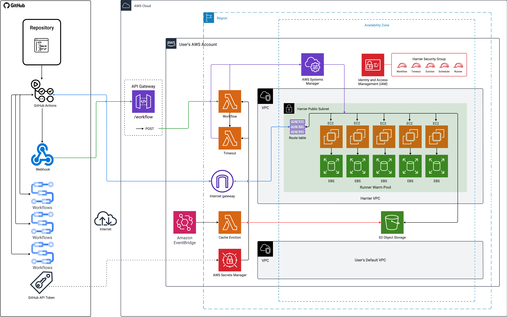

## Overview

This repository contains the automated deployment process for Harrier, an open-source pipeline designed to simplify the processing of unstructured data and its integration into modern knowledge bases.

To learn more about Harrier, visit our [website](https://harrier-gha-runner.github.io/) and [case study](https://harrier-gha-runner.github.io/case-study/).

## Infrastructure Overview

Harrier deploys the following key components in your AWS account:

  

## Deployment and Management

Harrier will deploy resources for you in your own AWS account, providing secure integration with your GitHub organization through OIDC standards and AWS Secrets Manager. You will never give any sensitive information, including passwords or keys, to Harrier.

To begin, follow the steps in the Installation section below to configure your AWS and GitHub to work together. You'll establis an identity provider and role in AWS IAM, generate your own personal access token in GitHub, and save it in your AWS Secrets Manager to allow your repo code to access your AWS.

Once these configurations are complete, you'll use the `Try Harrier` feature to get your setup YAML file. Just specify your configuration preferences, or rely on smart default values. Then you will receive a setup.yml file, which you'll copy and pasted into a new workflow action in any repository within your GitHub organization. Executing this workflow will deploy your new self-hosted runners in your AWS, fully at your service and control.

Your new action based on the setup.yml first automates preparatory tasks such as setting up Node.js and configuring AWS credentials with the user's designated IAM role. Once the groundwork is complete, the action executes the Harrier Setup Action from the GitHub public marketplace. Harrier Setup is a JavaScript packed action which deploys the required infrastructure using code from the action repository. The project is open-source which means that anyone can browse and check the code and functionality before executing.

Using your new self-hosted runner is a simple one-line change in any workflow:
- ubuntu-latest  
+ self-hosted

### Preflight Check

Before starting with Harrier, make sure you have the following:

- An active AWS account
- An active GitHub account
- A GitHub organization

### AWS Confirmation

1. Login to your AWS Account.
2. Copy your AWS Account ID 12-digit number and save it for yourself somewhere safe. Usually your number is in the AWS drop down menu, top-right corner.

### AWS, Create an IAM Identity Provider

1. In your AWS account dashboard, go to Identity and Access Management (IAM)
2. Select Identity Providers from the left-hand menu
3. Press the “Add provider” button
4. Choose “OpenID Connect” provider type
5. For Provider URL, input:`https://token.actions.githubusercontent.com`
6. For Audience, input: sts.amazonaws.com (if you are in the USA)
7. Press the “Add provider” button

8. Click into the new provider called "token.actions.githubusercontent.com"
9. Press the “Assign role” button, on the top-right
10. “Create a new role”, and push the “Next” button
11. Select the “Web identity” Trusted entity type
12. Select the “token.actions.githubusercontent.com” Identity provider from the drop down
13. Select the “sts.amazonaws.com” Audience from the drop down
14. Enter your GitHub organization name (e.g. harrier-gha-runner), and push the “Next” button
15. Add these permissions:
- AmazonVPCFullAccess
- AmazonEC2FullAccess
- AmazonS3FullAccess
- AWSLambda_FullAccess
- IAMFullAccess
- AmazonAPIGatewayAdministrator
- AmazonEventBridgeFullAccess
- AWSWAFConsoleFullAccess
- SecretsManagerReadWrite
16. Name the role `setup-harrier`. Harrier will not deploy if the role is named anything other than `setup-harrier`.
17. Select the newly created role and push the “Create role” orange button. Now your Identity Provider and role are ready!

### GitHub, Create a new Personal Access Token

Follow the steps on [docs.github.com](https://docs.github.com/en/authentication/keeping-your-account-and-data-secure/managing-your-personal-access-tokens#creating-a-personal-access-token-classic) here, or: 
1. Login to github.com, click your profile photo (top-right) and select [“Settings”](https://github.com/settings/profile) from the drop-down menu.
2. In the left sidebar, click "Developer settings" (towards the bottom).
3. In the left sidebar, under Personal access tokens, click "Tokens (classic)".
4. Select "Generate new token", then click "Generate new token (classic)".
5. In the "Note" field, give your token a descriptive name.
6. Select Expiration, then choose a default option or click Custom to enter a date.
7. Select the 4 following scopes to grant this token:
- repo
- workflow
- admin:org
- admin:org_hook
8. Click "Generate token."
9. Copy your new token and save it somewhere safe for later.

### On AWS, Create a new AWS Secret
1. In your AWS account dashboard, go to Secrets Manager
2. Press the “Store a new secret” button, on the top-right
3. Select “Other type of secret” secret type
4. Select “Plaintext” Key/value pairs
5. Overwrite the {“”:””} with the GitHub Personal Access Token you copied earlier. Your GitHub token should be the only text in the text field.
6. Push the “Next” button
7. Enter `github/pat/harrier` as the Secret name. Access will not work if your secret is named anything other than `github/pat/harrier`.
8. Push the “Next” button
9. Leave the Automatic rotation option off by default
10. Push the “Next” button
11. Review details and push the “Store” button at the bottom of the page

### Optionally, Create GitHub secrets to keep Dockerhub Username and Token
This is useful if you want to use the docker/build-and-push action to push Docker images to your registry.
Follow the steps on [docs.github.com](https://docs.github.com/en/actions/security-for-github-actions/security-guides/using-secrets-in-github-actions#creating-secrets-for-a-repository) or: 
1. On GitHub, navigate to the main page of the repository you want to use Harrier in.
2. Under your repository name, click the Settings cog

3. In the "Security" section of the sidebar, select  Secrets and variables, then click Actions.
4. Click the Secrets tab and select "New repository secret".
5. In the Name field, type a name for your secret, such as `DOCKER_USER` or `DOCKER_TOKEN`
6. In the Secret field, enter the value for your secret, such as your Dockerhub username or Dockerhub token copied from your Docker account settings.
7. Click Add secret.

### Deploying Harrier

To have Harrier deploy your AWS infra resources, run the Harrier-setup action

### Using Harrier self-hosted runners in your GitHub Actions workflows

### Using Harrier persistent cache in your GitHub Actions workflows

### Destroying Harrier Infrastructure

To tear down the Harrier infrastructure from your AWS, run the Harrier-cleanup action

This action will delete all Harrier-related resources in your AWS account.

**⚠ Important:**  
Destroying the infrastructure will permanently delete all associated resources and data. This action is irreversible, so proceed with caution. If you wish, you can always set Harrier up again with a fresh start.
